# Okabe-Ito: palette audit

Eight-colour categorical palette presented by Masataka Okabe and Kei Ito as part of their Color Universal Design guidance and later popularised in scientific publishing by Bang Wong.

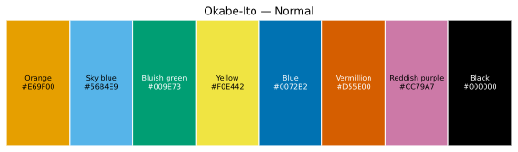

## Palette metadata

- Input: [`okabe-ito.yaml`](inputs/01-okabe-ito.yaml)
- Source: https://jfly.uni-koeln.de/color/
- Colours: 8
- Machine-readable provenance: [`metadata.json`](metadata.json)

## Methodology and assumptions

Input values are interpreted as six-digit, gamma-encoded sRGB. For each simulated condition, sRGB values are transformed with Colorspacious's `sRGB1+CVD` model, which implements the Machado et al. model, then clipped to the displayable sRGB gamut. Display-bound sRGB is converted through CIE XYZ to CIE Lab using the sRGB D65 reference white. Pairwise differences use CIEDE2000 (ΔE00) from Colour Science for Python. Grayscale values preserve WCAG relative luminance. Condition-level clipping summaries are in [`metadata.json`](metadata.json) and [`data/conditions.csv`](data/conditions.csv); affected colours and their raw and clipped RGB values are in [`data/gamut_clipping.csv`](data/gamut_clipping.csv).

The simulated severity percentages are model parameters, not clinical measurements. Partial tritan simulations are supported by the underlying function but are omitted from the standard report because inherited tritan deficiency is rarer and severity interpolation has a less direct evidential basis than the primary red–green use case.

## Overview

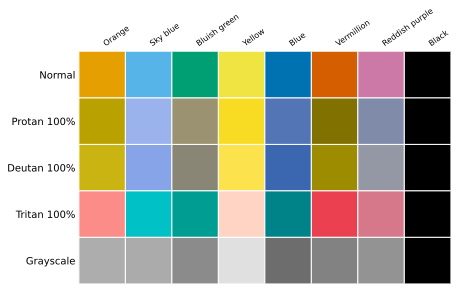

## Simulated CVD palette strips

### Protan 100%

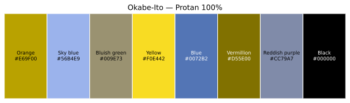

### Deutan 100%

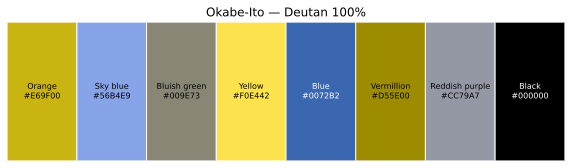

### Tritan 100%

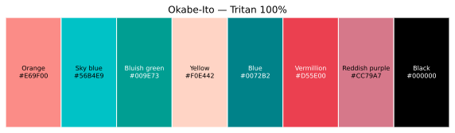

## Severity progressions

### Protan progression

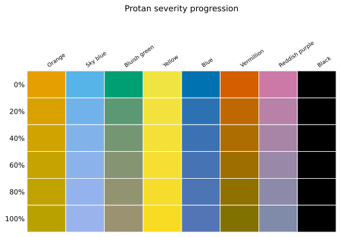

### Deutan progression

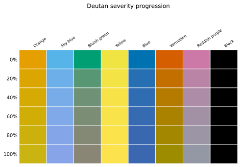

## Summary statistics

| Condition | Severity | Minimum ΔE00 | Pair | Maximum | Mean | Median | SD | 10th percentile |
| --- | --- | --- | --- | --- | --- | --- | --- | --- |
| normal | 0 | 21.73 | orange / yellow | 88.42 | 48.64 | 49.49 | 14.60 | 30.98 |
| protan20 | 20 | 17.99 | orange / yellow | 87.99 | 45.94 | 47.83 | 15.06 | 30.08 |
| protan40 | 40 | 15.95 | orange / yellow | 87.58 | 43.79 | 44.26 | 15.86 | 25.87 |
| protan60 | 60 | 15.03 | orange / yellow | 87.19 | 42.14 | 42.76 | 16.52 | 21.60 |
| protan80 | 80 | 14.86 | orange / yellow | 86.81 | 40.89 | 42.13 | 17.24 | 17.53 |
| protan100 | 100 | 12.25 | blue / reddish_purple | 86.44 | 40.25 | 41.66 | 17.85 | 17.08 |
| deutan20 | 20 | 16.96 | orange / yellow | 88.63 | 45.80 | 48.06 | 15.45 | 30.67 |
| deutan40 | 40 | 14.27 | orange / yellow | 88.84 | 43.72 | 42.83 | 16.55 | 25.91 |
| deutan60 | 60 | 12.79 | orange / yellow | 89.07 | 42.21 | 40.46 | 17.40 | 22.32 |
| deutan80 | 80 | 12.00 | orange / yellow | 89.31 | 41.10 | 38.83 | 18.25 | 20.53 |
| deutan100 | 100 | 11.61 | orange / yellow | 89.55 | 40.49 | 37.25 | 19.13 | 15.83 |
| tritan100 | 100 | 10.87 | orange / reddish_purple | 83.86 | 43.75 | 49.79 | 20.01 | 13.42 |
| grayscale | 0 | 0.60 | orange / sky_blue | 83.83 | 23.21 | 14.29 | 19.72 | 5.37 |

Counts below the descriptive thresholds ΔE00 < 5, ΔE00 < 10, ΔE00 < 15, ΔE00 < 20 are available in `data/summary.csv`. No threshold is treated as a universal accessibility pass/fail criterion.

## Palette characteristics

| Colour | HEX | RGB | L* | Chroma | Relative luminance | Contrast white | Contrast black | Group |
| --- | --- | --- | --- | --- | --- | --- | --- | --- |
| Orange | #E69F00 | 230 159 0 | 70.61 | 76.48 | 0.4162 | 2.25 | 9.32 | — |
| Sky blue | #56B4E9 | 86 180 233 | 69.83 | 36.78 | 0.4050 | 2.31 | 9.10 | — |
| Bluish green | #009E73 | 0 158 115 | 57.74 | 47.49 | 0.2569 | 3.42 | 6.14 | — |
| Yellow | #F0E442 | 240 228 66 | 89.11 | 76.63 | 0.7441 | 1.32 | 15.88 | — |
| Blue | #0072B2 | 0 114 178 | 45.97 | 41.45 | 0.1525 | 5.19 | 4.05 | — |
| Vermillion | #D55E00 | 213 94 0 | 54.19 | 76.67 | 0.2215 | 3.87 | 5.43 | — |
| Reddish purple | #CC79A7 | 204 121 167 | 61.05 | 39.97 | 0.2930 | 3.06 | 6.86 | — |
| Black | #000000 | 0 0 0 | 0.00 | 0.00 | 0.0000 | 21.00 | 1.00 | — |

## Pairwise comparisons

The lower half of each pair matrix places two colours in direct diagonal contact; the upper half gives their ΔE00 value.

### Pairwise ΔE00 heatmaps

#### Normal

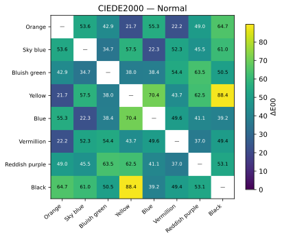

#### Protan 100%

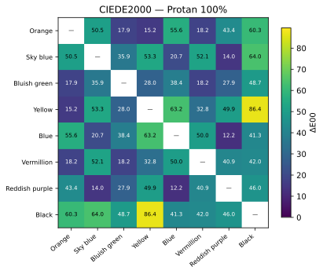

#### Deutan 100%

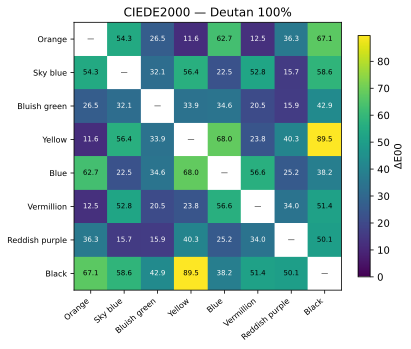

#### Tritan 100%

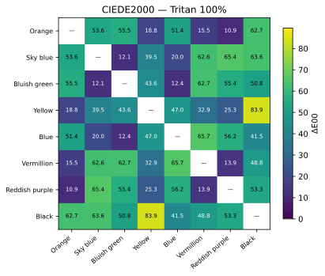

### Diagonal split pair matrices

#### Normal

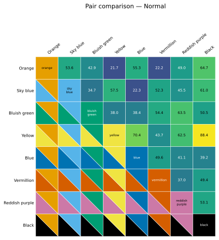

#### Protan 100%

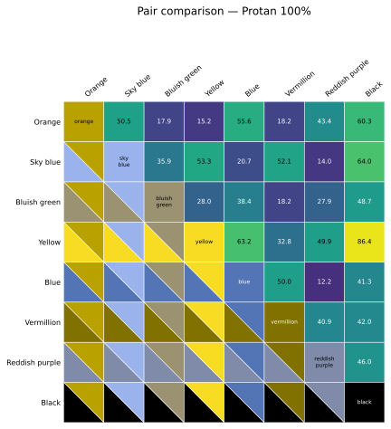

#### Deutan 100%

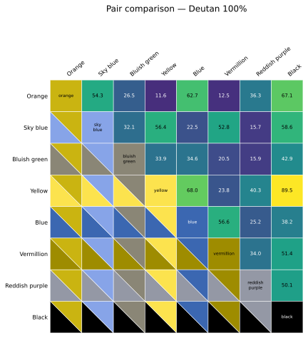

#### Tritan 100%

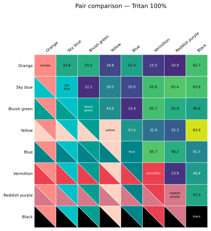

- [All pairwise data](data/pairwise.csv)

## Weakest pairs and severity progression

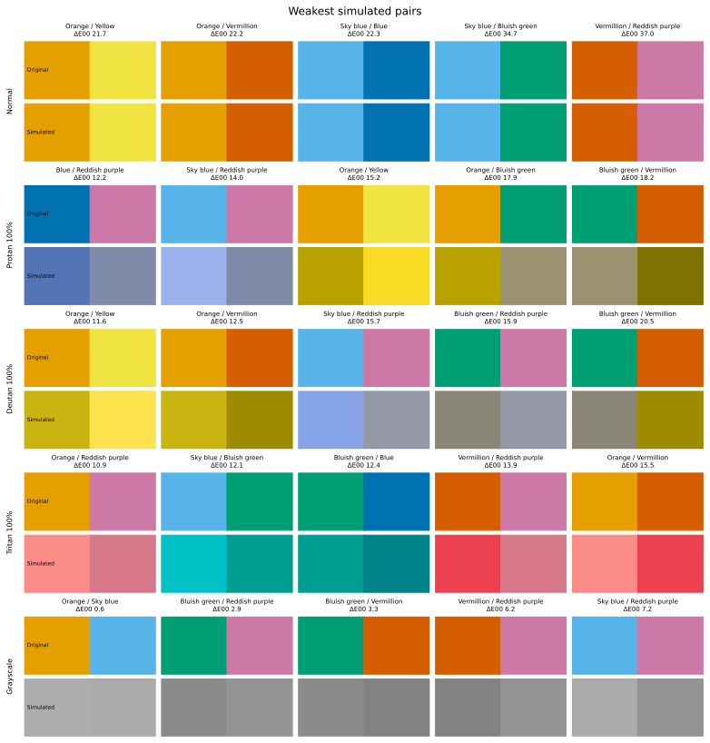

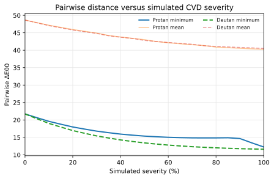

The identity of the minimum pair at each sampled severity is recorded in `data/severity_curves.csv`.

## Grayscale and lightness

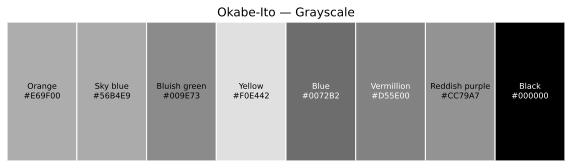

Grayscale is an additional robustness analysis; categorical palettes need not be fully discriminable by lightness alone when redundant encodings are provided.

## Caveats

Simulated CVD and perceptual-distance metrics support accessibility assessment, but they do not constitute validation with people who have CVD. Perception also depends on monitor calibration, viewing conditions, visual acuity, ageing, print reproduction, spatial context, and mark size. Colour should not be the sole carrier of critical information.

## Complete outputs

Requested figure formats (SVG, PDF, PNG) are in `figures/`; Markdown and booktabs LaTeX tables are in `tables/`; canonical CSV/JSON data, including gamut-clipping provenance, are in `data/`; and an exact copy of the input palette is in `inputs/`.
